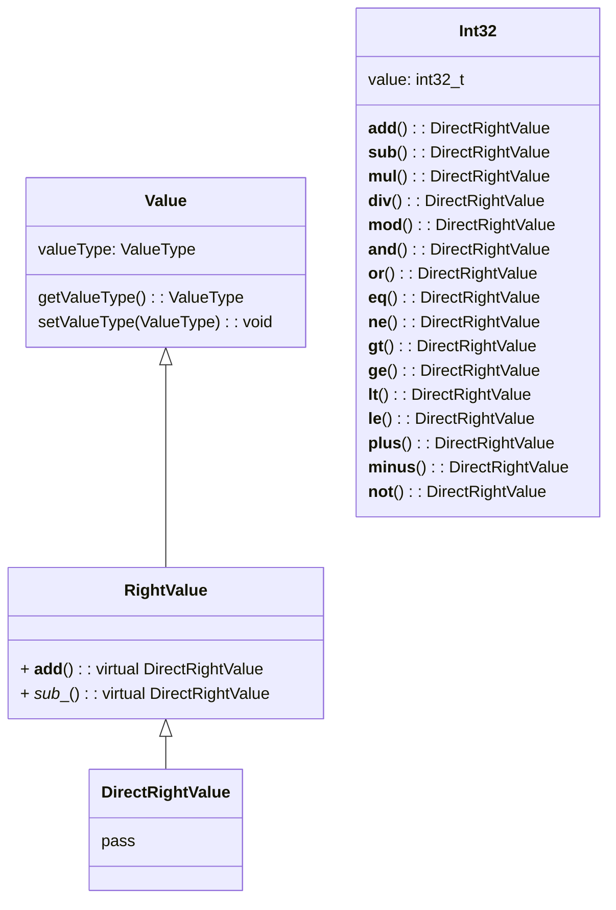

| 类 | 说明 | 父类|
| --- | --- |--- |
| Value | 值 | |
| RightValue | 右值 | Value |
| DirectRightValue | 直接右值 | RightValue |
| Int32 | 32位有符号整数 | DirectRightValue |
| Float32 | 32位浮点数 | DirectRightValue |
| Boolean | 布尔值 | DirectRightValue |
| Pointer | 指针 | DirectRightValue |
| InitializerList | 初始化列表 | DirectRightValue |
| IndirectRightValue | 间接右值 | RightValue |
| Binary | 二元运算 | IndirectRightValue |
| Unary | 一元运算 | IndirectRightValue |
| FunctionCall | 函数调用 | IndirectRightValue |
| TemporaryRightValue | 临时右值 | RightValue |
| Identifier | 标识符 | TemporaryRightValue |

**Value**

| 字段 | 说明 | 类型 | 可见性 |
| --- | --- | --- | --- |
| valueType | 值类型 | ValueType | protected |

| 方法 | 说明 | 返回值类型 | 可见性 |
| --- | --- | --- | --- |
| getValueType | 获取值类型 | ValueType | public |
| setValueType | 设置值类型 | void | public |

**RightValue**

| 虚方法 | 说明 | 返回值类型 | 可见性 |
| --- | --- | --- | --- |
| \_\_add\_\_ | 加法 | DirectRightValue | public |
| \_\_sub\_\_ | 减法 | DirectRightValue | public |
| \_\_mul\_\_ | 乘法 | DirectRightValue | public |
| \_\_div\_\_ | 除法 | DirectRightValue | public |
| \_\_mod\_\_ | 取模 | DirectRightValue | public |
| \_\_and\_\_ | 与 | DirectRightValue | public |
| \_\_or\_\_ | 或 | DirectRightValue | public |
| \_\_eq\_\_ | 等于 | DirectRightValue | public |
| \_\_ne\_\_ | 不等于 | DirectRightValue | public |
| \_\_gt\_\_ | 大于 | DirectRightValue | public |
| \_\_ge\_\_ | 大于等于 | DirectRightValue | public |
| \_\_lt\_\_ | 小于 | DirectRightValue | public |
| \_\_le\_\_ | 小于等于 | DirectRightValue | public |
| \_\_plus\_\_ | 正号 | DirectRightValue | public |
| \_\_minus\_\_ | 负号 | DirectRightValue | public |
| \_\_not__ | 非 | DirectRightValue | public |
| isDirect | 是否可以被视为直接右值 | bool | public |
| directify | 转换为直接右值 | DirectRightValue | public |





# 值 Value

- 类型 valueType

# 值类型 ValueType


# 右值 RightValue

```cpp
class RightValue {};
```

## 直接右值 DirectRightValue
```cpp
class DirectRightValue : public RightValue {
public:
    virtual DirectRightValue *__add__(DirectRightValue *right) = 0;
    virtual DirectRightValue *__sub__(DirectRightValue *right) = 0;
    virtual DirectRightValue *__mul__(DirectRightValue *right) = 0;
    virtual DirectRightValue *__div__(DirectRightValue *right) = 0;
    virtual DirectRightValue *__mod__(DirectRightValue *right) = 0;
    virtual DirectRightValue *__and__(DirectRightValue *right) = 0;
    virtual DirectRightValue *__or__(DirectRightValue *right) = 0;
    virtual DirectRightValue *__eq__(DirectRightValue *right) = 0;
    virtual DirectRightValue *__ne__(DirectRightValue *right) = 0;
    virtual DirectRightValue *__gt__(DirectRightValue *right) = 0;
    virtual DirectRightValue *__ge__(DirectRightValue *right) = 0;
    virtual DirectRightValue *__lt__(DirectRightValue *right) = 0;
    virtual DirectRightValue *__le__(DirectRightValue *right) = 0;
    virtual DirectRightValue *__plus__() = 0;
    virtual DirectRightValue *__minus__() = 0;
    virtual DirectRightValue *__not__() = 0;
};
```
### int32
32位有符号整数
```cpp
class Int32 : public DirectRightValue {
public:
    int32_t value;
    Int32(int32_t value);
    DirectRightValue *__add__(DirectRightValue *right) override {
        if constexpr (std::is_same_v<Int32, decltype(*right)>){
            return new Int32(value + right->value);
        }else{
            throw Compiler::Error::InvalidOperation();
        }
    }
    DirectRightValue *__sub__(DirectRightValue *right) override {
        if constexpr (std::is_same_v<Int32, decltype(*right)>){
            return new Int32(value - right->value);
        }else{
            throw Compiler::Error::InvalidOperation();
        }
    }
    DirectRightValue *__mul__(DirectRightValue *right) override {
        if constexpr (std::is_same_v<Int32, decltype(*right)>){
            return new Int32(value * right->value);
        }else{
            throw Compiler::Error::InvalidOperation();
        }
    }
    DirectRightValue *__div__(DirectRightValue *right) override {
        if constexpr (std::is_same_v<Int32, decltype(*right)>){
            if (right->value == 0){
                throw Compiler::Error::DivideByZero();
            }
            if (value % right->value == 0){
                return new Int32(value / right->value);
            }else{
                return new Float32(value / right->value);
            }
        }else{
            throw Compiler::Error::InvalidOperation();
        }
    }
    DirectRightValue *__mod__(DirectRightValue *right);
    DirectRightValue *__and__(DirectRightValue *right);
    DirectRightValue *__or__(DirectRightValue *right);
    DirectRightValue *__eq__(DirectRightValue *right);
    DirectRightValue *__ne__(DirectRightValue *right);
    DirectRightValue *__gt__(DirectRightValue *right);
    DirectRightValue *__ge__(DirectRightValue *right);
    DirectRightValue *__lt__(DirectRightValue *right);
    DirectRightValue *__le__(DirectRightValue *right);
    DirectRightValue *__plus__();
    DirectRightValue *__minus__();
    DirectRightValue *__not__();
};
```
# float32
- float32
- boolean
- void
- pointer
- initializer_list

以下为可能可以执行的运算

如果不合法，会抛出Compiler::Error::InvalidOperation异常

需要记录是什么运算，以及参与运算的类型

### add

#### valid syntax
```
int32 + int32 : int32
float32 + float32 : float32
pointer + int32 : pointer
```

### __sub__

#### valid syntax
```
int32 - int32 : int32
float32 - float32 : float32
pointer - int32 : pointer
pointer - pointer : int32
```

### __mul__

#### valid syntax
```
int32 * int32 : int32
float32 * float32 : float32
```

### __div__

考虑除0错误

#### valid syntax
```
int32 / int32 : int32 或者 float32
float32 / float32 : float32
```

### __

考虑除0错误

#### valid syntax
```
int32 % int32 : int32
```

### and

#### valid syntax
```
boolean && boolean : boolean
```

### or

#### valid syntax
```
boolean || boolean : boolean
```

### not

#### valid syntax
```
!boolean : boolean
```

### eq

#### valid syntax
```
int32 == int32 : boolean
float32 == float32 : boolean
pointer == pointer : boolean
boolean == boolean : boolean
```

### ne

#### valid syntax
```
int32 != int32 : boolean
float32 != float32 : boolean
pointer != pointer : boolean
boolean != boolean : boolean
```

### gt

#### valid syntax
```
int32 > int32 : boolean
float32 > float32 : boolean
pointer > pointer : boolean
```

### ge

#### valid syntax
```
int32 >= int32 : boolean
float32 >= float32 : boolean
pointer >= pointer : boolean
```

### lt

#### valid syntax
```
int32 < int32 : boolean
float32 < float32 : boolean
pointer < pointer : boolean
```

### le

#### valid syntax
```
int32 <= int32 : boolean
float32 <= float32 : boolean
pointer <= pointer : boolean
```

### plus

#### valid syntax
```
+int32 : int32
+float32 : float32
```

### minus

#### valid syntax
```
-int32 : int32
-float32 : float32
```

### not

#### valid syntax
```
!boolean : boolean
```

## 间接右值

- binary
- unary
- function_call

## 临时右值

- identifier
