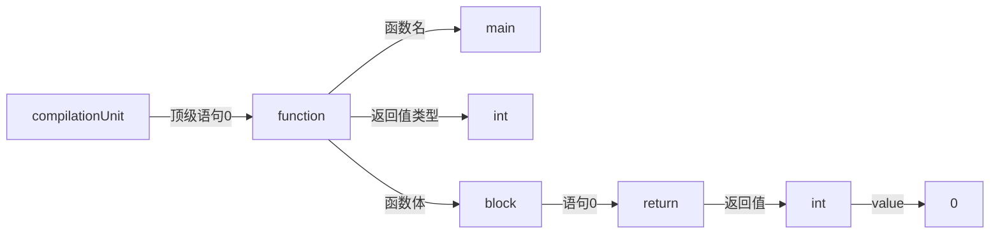
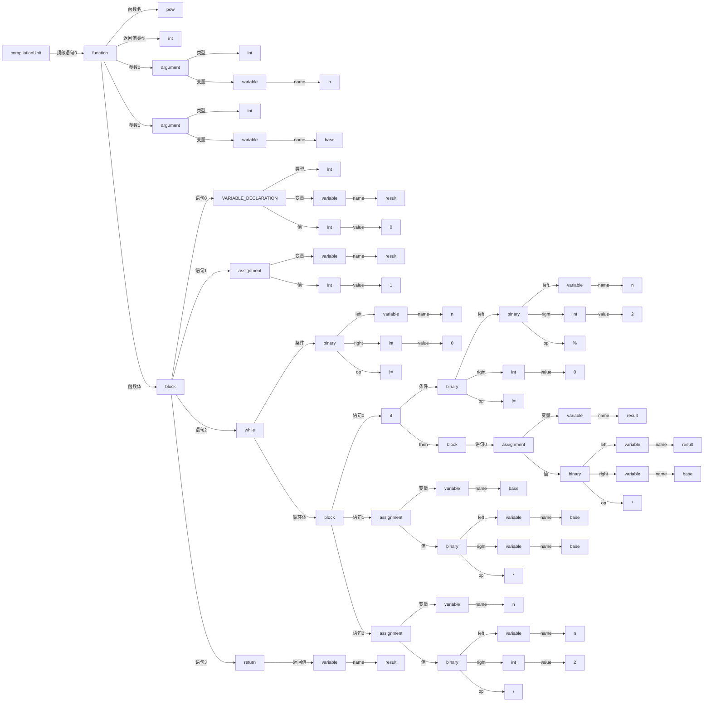

# **main**


```c
int main(){
	return 0;
}
```




# **function**
```c
int pow(int n,int base){
    int result;
    result = 1;
    while(n != 0){
        if (n % 2 != 0) 
            result =result *base;
        base = base * base;
        n = n /2;
    }
    return result;
}
```

