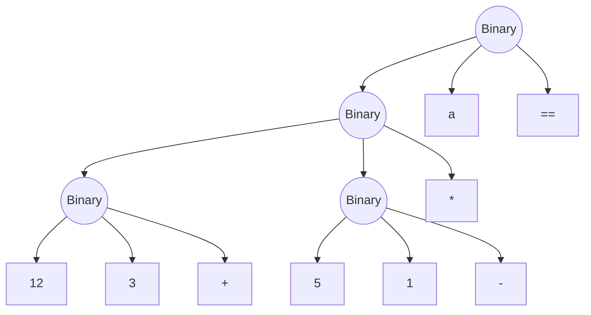
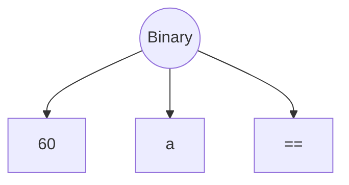

# introduction
本文档描述了SED编译器的类型系统和值系统

# 使用说明

## 目前支持的值类型

- Int32, 有符号32位整数
- Float32, 符合IEEE754标准的32位浮点数
- Boolean, 布尔值, 只有两个取值: true和false
- Char, 字符, 一个字节

> 定义一个变量
> ```c
> int a = 1;
> float b = 1.0;
> bool c = true;
> char d = 'a';
> ```

又将Int32, Float32, Boolean, Char统称为平凡类型

## 类型转换

1. 只支持强制类型转换, 不支持隐式类型转换
2. 类型转换的保留字模仿c语言风格设计
    - (int)
    - (float)
    - (bool)
    - (char)

> 类型转换
> ```c
> a = (int) (10.0 / 3.0);
> ```

# 设计说明

## 类型运算

> 所有的类型运算都视为下列2种情况的一种
> 1. 二元表达式的左操作数的函数调用
> 2. 一元表达式的操作数的函数调用

> 只标注合法运算, 不合法运算将交由错误处理模块处理

当前合法的类型运算如下:

| 运算 | 左操作数类型 | 右操作数类型 | 返回值类型 | 语义 |
| --- | --- | --- | --- | --- |
| + | Int32 | Int32 | Int32 | 两个整数相加 |
| - | Int32 | Int32 | Int32 | 两个整数相减 |
| * | Int32 | Int32 | Int32 | 两个整数相乘 |
| / | Int32 | Int32 | Int32 | 两个整数相除, 本质是整除 |
| % | Int32 | Int32 | Int32 | 两个整数取余 |
| == | Int32 | Int32 | Boolean | 两个整数相等 |
| != | Int32 | Int32 | Boolean | 两个整数不相等 |
| > | Int32 | Int32 | Boolean | 大于 |
| >= | Int32 | Int32 | Boolean | 大于等于 |
| < | Int32 | Int32 | Boolean | 小于 |
| <= | Int32 | Int32 | Boolean | 小于等于 |
| + | Float32 | Float32 | Float32 | 两个浮点数相加 |
| - | Float32 | Float32 | Float32 | 两个浮点数相减 |
| * | Float32 | Float32 | Float32 | 两个浮点数相乘 |
| / | Float32 | Float32 | Float32 | 两个浮点数相除 |
| == | Float32 | Float32 | Boolean | 两个浮点数相等 |
| != | Float32 | Float32 | Boolean | 两个浮点数不相等 |
| > | Float32 | Float32 | Boolean | 大于 |
| >= | Float32 | Float32 | Boolean | 大于等于 |
| < | Float32 | Float32 | Boolean | 小于 |
| <= | Float32 | Float32 | Boolean | 小于等于 |
| && | Boolean | Boolean | Boolean | 与 |
| \|\| | Boolean | Boolean | Boolean | 或 |
| ! | Boolean | Boolean | Boolean | 非 |
| + | Int32 | - | Int32 | 正号 |
| - | Int32 | - | Int32 | 负号 |
| + | Float32 | - | Float32 | 正号 |
| - | Float32 | - | Float32 | 负号 |
| + | Char | Int32 | Char | 字符加整数 |
| - | Char | Int32 | Char | 字符减整数 |
| + | Int32 | Char | Char | 整数加字符 |
| - | Int32 | Char | Char | 整数减字符 |
| == | Char | Char | Boolean | 字符相等 |
| != | Char | Char | Boolean | 字符不相等 |
| > | Char | Char | Boolean | 大于 |
| >= | Char | Char | Boolean | 大于等于 |
| < | Char | Char | Boolean | 小于 |
| <= | Char | Char | Boolean | 小于等于 |
| (int) | Float32 | - | Int32 | 强制类型转换 |
| (float) | Int32 | - | Float32 | 强制类型转换 |
| (bool) | Int32 | - | Boolean | 强制类型转换 |
| (bool) | Float32 | - | Boolean | 强制类型转换 |
| (int) | Boolean | - | Int32 | 强制类型转换 |
| (char) | Int32 | - | Char | 强制类型转换 |
| (int) | Char | - | Int32 | 强制类型转换 |

## 值运算

值运算的合法情况与类型运算的合法情况一致, 唯一的区别是值运算会返回一个值

准确地来说是SED::AST::Value的子类的实例

## 值系统

值系统是SED编译器的核心, 它负责管理所有的值, 并且提供值运算的接口

值系统的设计思路是将所有的值都视为SED::AST::Value的子类的实例

值分为两种:
1. 常量值, 由继承了SED::AST::Constant抽象类的子类实例化
> 常量值的子类
> SED::AST::Int32
> SED::AST::Float32
> SED::AST::Boolean
> SED::AST::Char
2. 变量值, 由继承了SED::AST::Mutable抽象类的子类实例化
> 变量值的子类
> SED::AST::Binary
> SED::AST::Unary
> SED::AST::Variable
> SED::AST::FunctionCall

在值系统中,实质上是不区分值和类型的,

类型的定义由ValueType枚举类定义
```cpp
enum class ValueType{
    Int32,
    Float32,
    Boolean,
    Char,
};
```
类型的计算由抽象类Constant的子类实现

**为什么要区分常量值和变量值?**
> 
> 1. 常量值的值在编译期间就已经确定, 可以直接计算, 而变量值的值在运行期间才能确定
> 2. 在语义分析时,可以将经过分析可以确定的值替换为常量值, 从而减少运行时的计算量,这部分在isConstant()函数和Constantify()函数中实现

**表达式类Binary和Unary的设计思路**

先进行类型运算, 再进行值运算

将其转化为左操作数的函数调用,即 Binary.add(left,right) -> left.add(right)

实质上不存在表达式

Binary和Unary只用于保留表达式树的树状结构

在语义分析中, 会剔除表达式树中所有的常量子树

例如 (12 + 3) * (5 - 1)  == a



会被转化为 60 == a



> 子树如果是不含Variable和FunctionCall的Binary或者Unary, 可以直接计算

> 对于具有常量性质的Variable和FunctionCall, 也可以直接计算,在优化时实现
> ```c
> int f(){
>     return 1;
> }
> int main(){
>     int a = f();
>     int b = 1;
>     return a + b;
> }
> ```


在这个例子中
所有对于f()的调用都可以被替换为1, 从而减少运行时的计算量
所有对于b的引用都可以被替换为1, 从而减少运行时的计算量

**Variable和FunctionCall的设计思路**
> 值运算

对于Variable和FunctionCall, 由于其值在运行时才能确定, 所以不能直接计算

值运算留有接口,供优化模块进行调用

> 类型运算

在语义分析中保存一个上下文, 其中一项是变量表,类型为std::map<std::string, SED::AST::Constant*>, 用于保存变量名和变量类型的映射关系,
其中另一项是函数表,类型为std::map<std::string, SED::AST::Constant*>, 用于保存函数名和函数类型的映射关系

在类型运算时, 会在上下文中查找变量名和函数名, 从而得到变量类型和函数类型,从而进行类型运算,完成类型检查